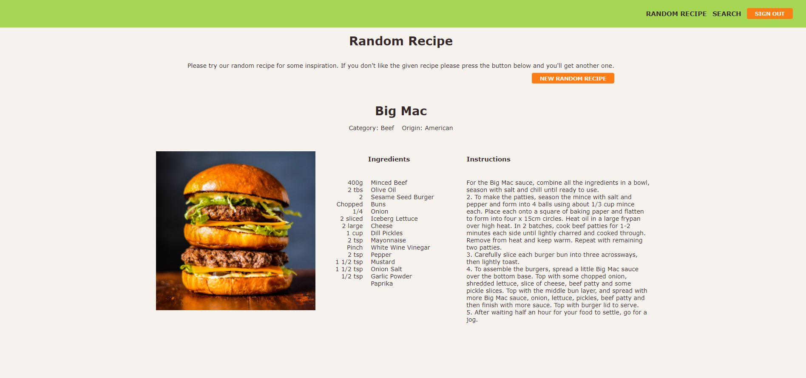

# Getting Started with the International food experience application

## Introduction
Many people will ask themselves what they should eat today. This is where this application comes in. 
After registration people can log into the application and start searching for a nice recipe. If the user needs some inspiration
they can choose for a rondom recipe. If the user doesn't like the random recipe they can press the button and get another.

There is also a search option for people that are looking for something more specific. Choose for category or origin and browse
through the possibilities. When the choice is made it is time to start or go shopping first. Or shop ride awary because it 
is mobile friendly so the user can search even in the supermarket.

##Installation Manual

### Installing the application
Step 1: Download the application.\
Step 2: Run `npm install` in the terminal of you text editor.

### Running the application
Step 1: Run `npm start` to start the application in the development mode.\
Step 2: React should automatically open the application on http://localhost:3000/. If it doesn't work please go to your browser and insert the url manually.

### Running tests
Run `npm test` in the terminal of you text editor.

## Registration
In order to acces the application you need to register. Please fill in a 
* Username: Example: Marian
* Email: Example: marian@gmail.com
* Password: Example: Marian100

## Sign In
After registration the user will be transfered to the Sign In Page. Please fill in:
* Username: Example: Marian
* Password: Example: Marian100

